# 📝 Student Quiz Portal

🚀 Student Quiz Portal is a full-stack web application designed to conduct secure and interactive online quizzes for students.

It supports both **Admin** and **Student** roles, allowing admins to manage quizzes and students to attempt tests with instant score evaluation.

This project demonstrates real-world concepts like authentication, database integration, session management, role-based access, and responsive UI design.

---


# 🖼️ Application Preview

## 🔐 Login Page
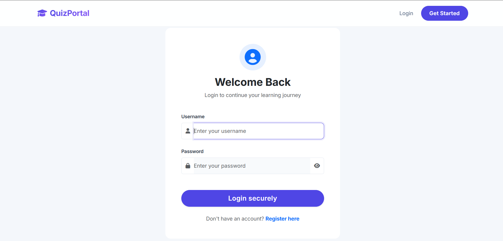

## 👨‍💼 Admin Dashboard
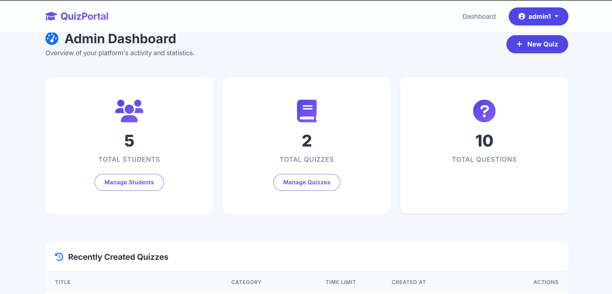

## 📝 Manage Quizzes
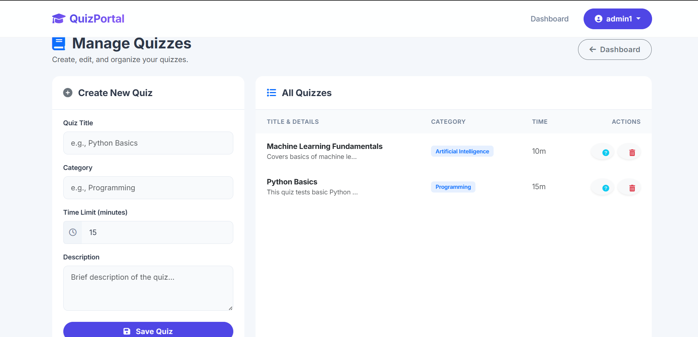

## ❓ Manage Questions
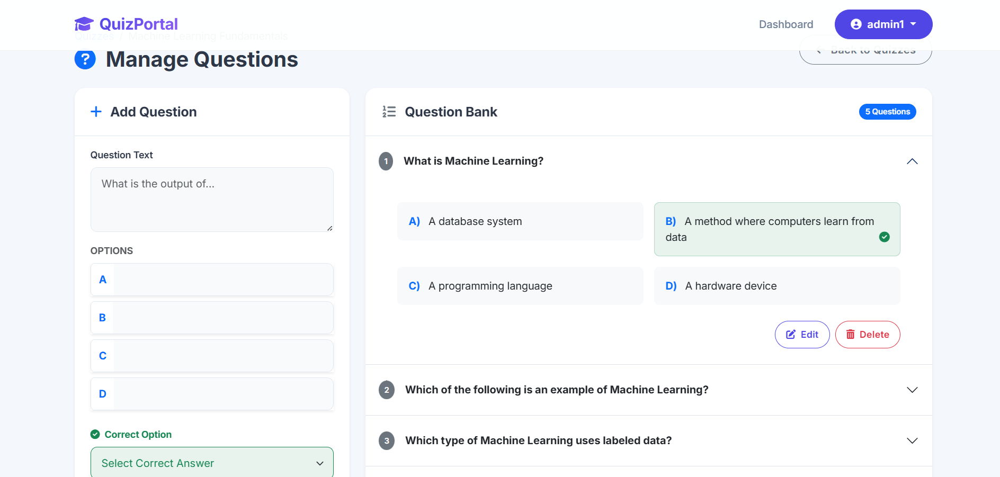

## ❓ Manage Students
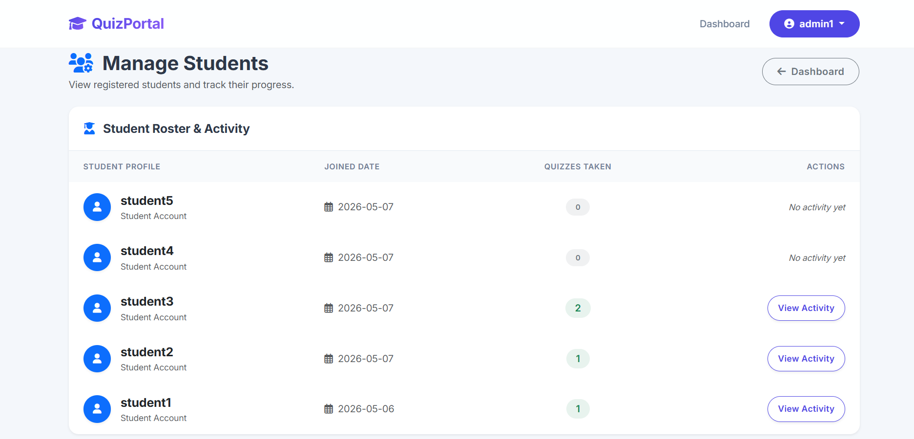

## 👨‍🎓 Student Dashboard
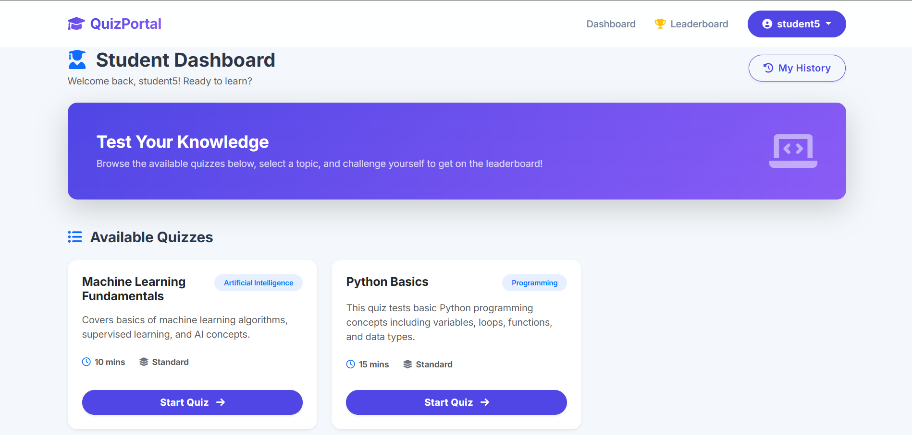

## 📝 Quiz Interface
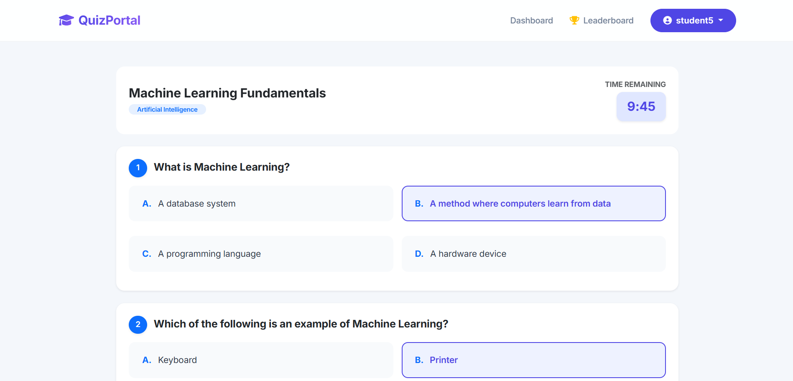

## 📊 Result Section
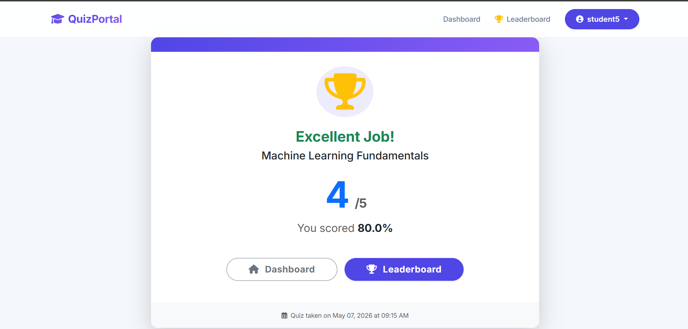

## 🏆 Leaderboard
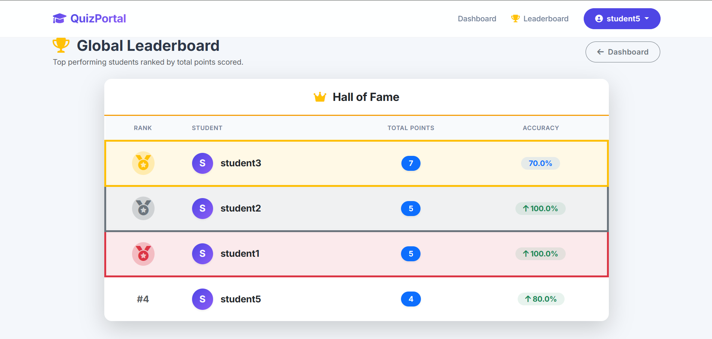

## 📜 Quiz History
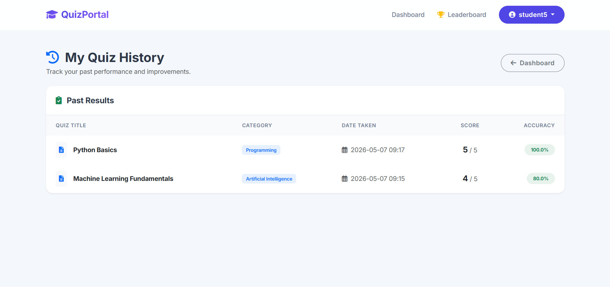

## 📝 Register Page
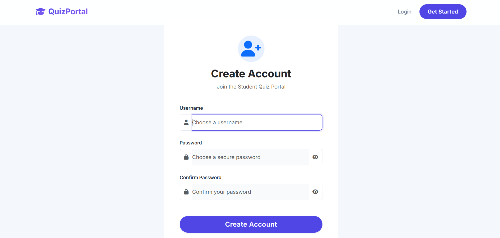

---

# ✨ Core Features

## 👤 Student Features
- 📝 Attempt quizzes online
- ⏱ Timer-based quiz system
- 📊 Instant score calculation
- 🏆 Leaderboard ranking
- 📈 Performance tracking

## 👑 Admin Features
- 🧑‍💼 Admin login system
- ➕ Add quiz questions
- ✏️ Edit & manage questions
- ❌ Delete questions
- 📊 Monitor student performance

## 🔐 Authentication & Security
- Secure login system
- Session management
- Role-based access control
- Input validation

---

# 🧩 Technology Stack

## 💻 Frontend
- HTML
- CSS
- JavaScript

## ⚙️ Backend
- Python Flask

## 🗄️ Database
- MySQL

## ☁️ Deployment
- GitHub
- Render

---

# 📱 Key Highlights
- Responsive UI design
- Modern dashboard interface
- Real-time score generation
- Dynamic leaderboard system
- Mobile-friendly layout

---

# 🎯 Use Cases
- 🎓 Student online quizzes
- 🧪 Practice tests
- 📚 Learning assessments
- 🏫 College mini projects

---

# 🔮 Future Enhancements
- 📧 Email notifications
- 🔐 OTP-based authentication
- 📱 Mobile application
- 📊 Advanced analytics dashboard
- 🧠 AI-based performance analysis

---

# 📂 Project Structure

```bash
Student_Quiz_Portal/
│── screenshots/
│── static/
│── templates/
│── app.py
│── database.sql
│── requirements.txt
│── README.md
